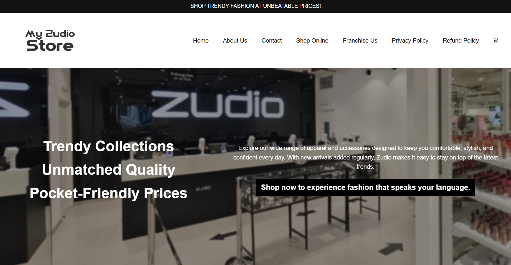

🛍️ My Zudio Store | Replica

A front-end replica of the Zudio fashion store, built using HTML5 and CSS3.
This project demonstrates responsive layouts, product listing, navigation, and basic styling inspired by Zudio’s official website.

📌 Features

✅ Landing Page with hero section & tagline

✅ Navigation Bar with links to all sections (Home, About, Contact, Shop, Policies, Franchise)

✅ Shop Section with category cards:

Men’s Collection

Women’s Collection

Kids Collection

Accessories

Footwear

✅ Individual Product Sections with categories (Shirts, Pants, Dresses, etc.)

✅ Policy Pages: Privacy Policy & Refund Policy

✅ Franchise Section with call-to-action button

✅ Contact Us section with Email, Phone, and Address

✅ Modern CSS Styling with hover effects, transitions, shadows, and custom fonts

✅ Responsive Layout using Flexbox & CSS grid

🖼️ Preview

🚀 Getting Started
1️⃣ Clone the Repository
git clone https://github.com/your-username/zudio-store-replica.git
cd zudio-store-replica

2️⃣ Run the Project

Open index.html in any browser

Or use VS Code Live Server extension for auto-refresh

🗂️ Project Structure
├── index.html          # Main HTML file
├── index.css           # Styling file
├── zudio-logo.jpg      # Favicon
├── Home-Ban.png        # Background banner
├── Images/             # Product images (Men, Women, Kids, Accessories, Footwear)
└── Fonts/              # Custom fonts (ZTNature, Negan-DEMO)

🎨 Technologies Used

HTML5 – Semantic structure

CSS3 – Flexbox, Grid, Animations, Custom Fonts

Custom Fonts – ZTNature, Negan-DEMO

📱 Responsiveness

Desktop ✅

Tablet ✅

Mobile (basic support) ✅

📜 License

This project is for educational purposes only.
It is a replica and not affiliated with or endorsed by Zudio.

✨ Made with ❤️ by [Nalgar Ahmed Faheen]
